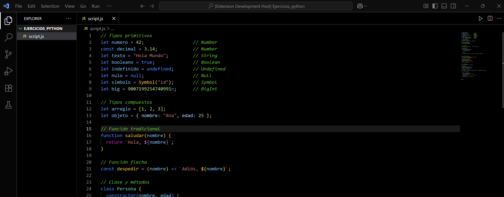
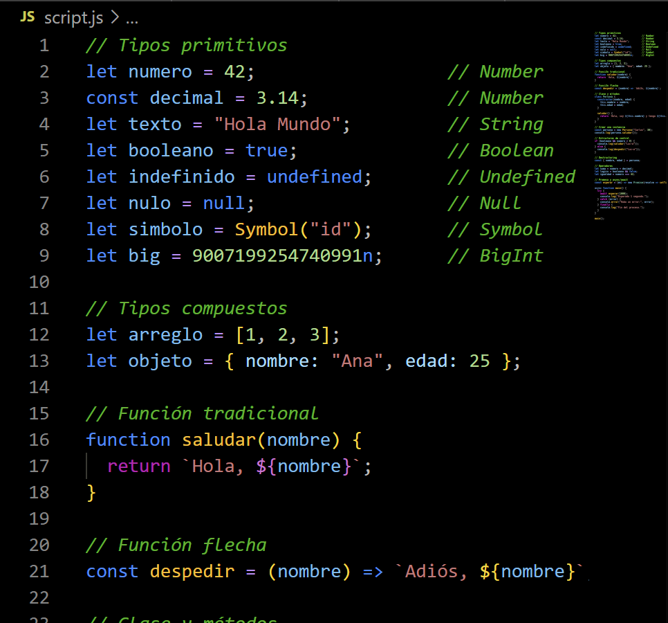
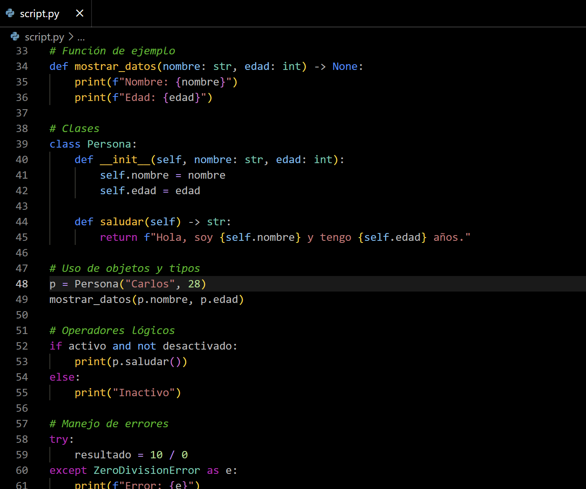
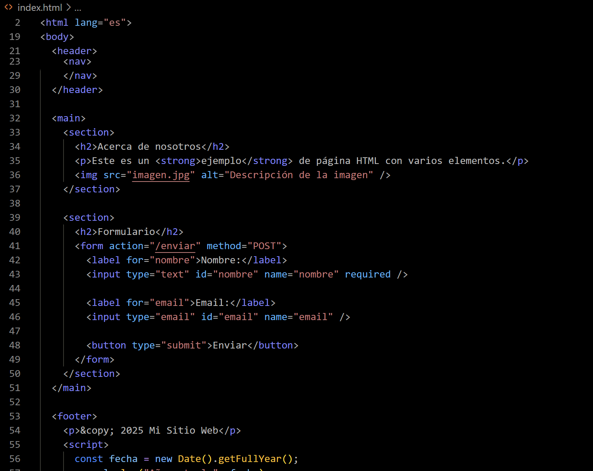

# Theme_Oscurin README

¡Bienvenido al lado oscuro del código!

**Theme_Oscurin** is a Visual Studio Code theme designed for developers who prefer a dark, sleek, and modern aesthetic. The colors are carefully selected to provide contrast, reduce eye strain, and maintain focus during long programming sessions.

## Characteristics

- Balanced color palette to reduce eye strain.
- Supports more than 50 programming languages.
- Custom colors for errors, warnings, and information messages
- Excellent readability on both LCD and OLED monitors

## Installation

1. Open Visual Studio Code  
2. Go to the Extensions Marketplace  
3. Search for: `Theme_Oscurin`  
4. Click **Install**  
5. Switch the theme in `Preferences > Color Theme`

## Screenshots

| JavaScript | Python | HTML |
|------------|--------|------|
|  |  |  |

---

## Author’s GitHub :)

This theme was created by:

**[github.com/vitadis](https://github.com/vitadis)**

Thanks for downloading this theme, you fine-looking dev 😏